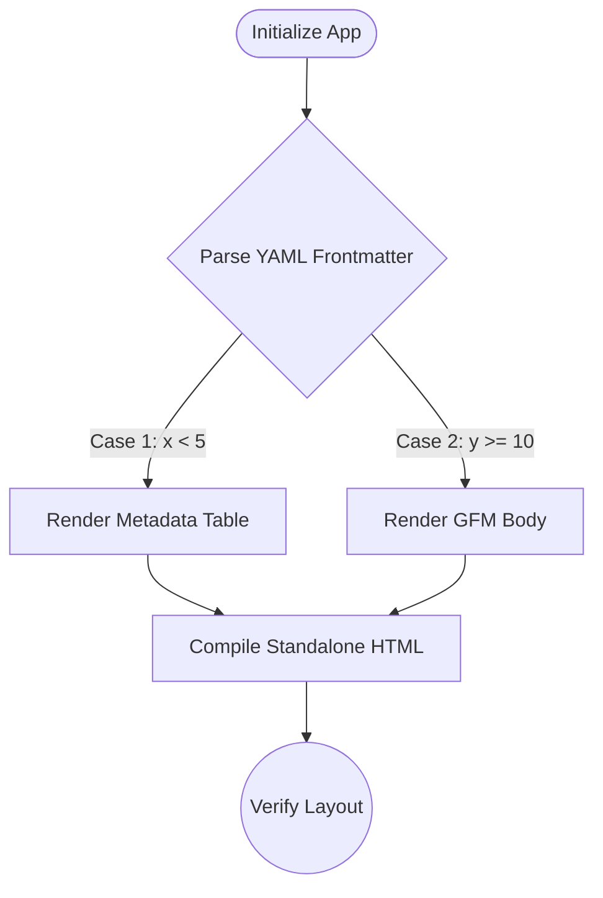

# Markdown Viewer Verification & Test Suite

This document is a comprehensive test suite designed to verify that the Markdown Viewer renders all standard and custom extensions correctly in the live preview and exports cleanly to standalone HTML and PDF formats.

---

## 1. YAML Frontmatter Verification (Fixes #109)
*The table below is rendered from the YAML frontmatter block at the very top of this document. It must render correctly in both the live preview pane and the exported HTML/PDF documents.*

- **Expected Behavior:** A styled metadata table containing headers (`document_type`, `version`, `last_updated`, `status`) must appear at the absolute top of the document.
- **Verification:** Export this document to HTML and check if the metadata table is styled with borders and clean background rows.

---

## 2. Mermaid Diagram rendering (XSS & Operator Escaping Fixes)
*This section tests if the Mermaid parser compiles flowcharts correctly without HTML-mangling when dealing with mathematical comparison operators like `<` or `>`.*



- **Expected Behavior:** A flowchart displaying the rendering pipeline must compile visually in the preview panel. The comparison texts `x < 5` and `y >= 10` must display correctly without causing syntax rendering errors.
- **Security Check:** Inline script elements inside Mermaid labels are strictly blocked by setting `securityLevel: 'strict'`.

---

## 3. Mathematical Formulations (LaTeX & MathJax Delimiters)
*This section tests that inline and block mathematical typesetting engines compile correctly without colliding with standard inline currency symbols.*

### Inline Math Test
The Pythagorean theorem is expressed as $a^2 + b^2 = c^2$.

### Block Math Test
The Gaussian distribution probability density function is represented as:

$$f(x \mid \mu, \sigma^2) = \frac{1}{\sigma \sqrt{2\pi}} e^{-\frac{(x - \mu)^2}{2\sigma^2}}$$

### Currency Delimiter Collision Test
*Standard currency symbols must NOT compile as LaTeX equations:*
- I bought this book for $5 and that markdown guide for $10. (Should render as standard text with raw dollar signs).

---

## 4. GitHub-Style Admonitions / Alerts
*This section verifies that GFM alert blocks render with matching accent colors, border highlights, and icons.*

> [!NOTE]
> This is a standard blue note alert. It provides general background information.

> [!TIP]
> This is a green tip alert. It highlights optimizations or recommended paths.

> [!IMPORTANT]
> This is a purple important alert. It documents essential steps.

> [!WARNING]
> This is a yellow warning alert. It warns of potential compatibility risks.

> [!CAUTION]
> This is a red caution alert. It flags high-risk data-loss actions.

---

## 5. Standard GitHub-Flavored Markdown (GFM)

### Syntax Highlighting (highlight.js)
```javascript
// Verification script for startup files
(async function verifyStartup() {
  const isDesktop = typeof Neutralino !== 'undefined';
  if (isDesktop && window.NL_INITIAL_FILE_CONTENT) {
    console.log("Startup file loaded successfully:", window.NL_INITIAL_FILE_CONTENT.name);
  }
})();
```

### Task Lists / Checklists
- [x] Fixed startup double-click race condition
- [x] Standardized modals with focus traps
- [x] Enabled case-insensitive drag-and-drop matches
- [ ] Implement incremental Mermaid rendering cache (Future)

### Tables
| Component | Status | Verification Link |
| :--- | :--- | :--- |
| Dynamic Tabs | **Fixed** | [Tab Bar](#1-yaml-frontmatter-verification-fixes-109) |
| Pane Resizer | **Fixed** | [Resizer Separator](#) |
| Math Equations | **Fixed** | [LaTeX block](#3-mathematical-formulations-latex--mathjax-delimiters) |

---

## 6. Custom Markdown Extensions

### Footnotes
Here is a simple footnote reference[^1] and a second complex one[^2].

[^1]: This is the first standard footnote text.
[^2]: This is the second footnote containing *styled markdown* and a backlink.

### Subscripts, Superscripts, and Highlights
- Water is H~2~O.
- The Einstein equation is E=mc^2^.
- Highly critical text must be ==highlighted in yellow== for scannability.
