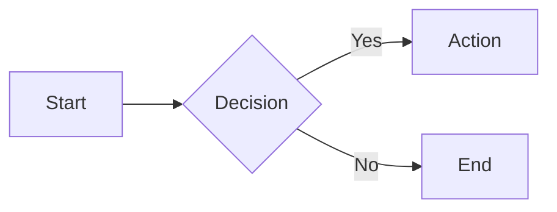

# Features

A detailed reference for every feature supported by **Markdown Viewer**.

---

## Table of Contents

- [Live Split-Screen Preview](#live-split-screen-preview)
- [GitHub-Style Rendering](#github-style-rendering)
- [Syntax Highlighting](#syntax-highlighting)
- [LaTeX Mathematical Equations](#latex-mathematical-equations)
- [Mermaid Diagrams](#mermaid-diagrams)
- [Dark / Light Theme](#dark--light-theme)
- [Export Options](#export-options)
- [File Import](#file-import)
- [Share via URL](#share-via-url)
- [Content Statistics](#content-statistics)
- [Emoji Support](#emoji-support)
- [Copy to Clipboard](#copy-to-clipboard)
- [Synchronized Scrolling](#synchronized-scrolling)
- [Resizable Panes](#resizable-panes)
- [Multiple View Modes](#multiple-view-modes)
- [Multi-Document Tabs](#multi-document-tabs)
- [Markdown Formatting Toolbar](#markdown-formatting-toolbar)
- [Find & Replace](#find--replace)
- [YAML Frontmatter](#yaml-frontmatter)
- [GitHub Alerts](#github-alerts)
- [Line Numbers](#line-numbers)
- [Fullscreen Mode](#fullscreen-mode)
- [Keyboard Shortcuts](#keyboard-shortcuts)
- [Responsive Design](#responsive-design)
- [Privacy & Security](#privacy--security)

---

## Live Split-Screen Preview

The editor and preview panes update simultaneously as you type. There is no "refresh" button — rendering happens on every keystroke using a debounced function to keep performance smooth.

- Rendering is powered by **[marked.js](https://marked.js.org/)**.
- The preview is styled with **[github-markdown-css](https://github.com/sindresorhus/github-markdown-css)**, giving output identical to GitHub's rendering engine.

---

## GitHub-Style Rendering

Markdown Viewer implements the **GitHub Flavored Markdown (GFM)** specification:

- Strikethrough (`~~text~~`)
- Tables
- Task lists (`- [x] item`)
- Fenced code blocks with language identifiers
- Autolinks
- Extended autolinks (e.g., bare URLs become clickable links)

---

## Syntax Highlighting

Code blocks are automatically syntax-highlighted for **190+ programming languages** using **[highlight.js](https://highlightjs.org/)**.

To enable highlighting, specify the language after the opening fence:

````markdown
```python
def hello(name: str) -> str:
    return f"Hello, {name}!"
```
````

**Supported languages include** (but are not limited to):

`bash`, `c`, `cpp`, `csharp`, `css`, `dart`, `diff`, `docker`, `go`, `graphql`, `haskell`, `html`, `java`, `javascript`, `json`, `kotlin`, `lua`, `markdown`, `nginx`, `perl`, `php`, `python`, `r`, `ruby`, `rust`, `scala`, `shell`, `sql`, `swift`, `toml`, `typescript`, `xml`, `yaml`, and many more.

---

## LaTeX Mathematical Equations

Mathematical expressions are rendered using **[MathJax](https://www.mathjax.org/)**.

### Inline Math

Wrap inline expressions with single dollar signs:

```markdown
The quadratic formula is $x = \frac{-b \pm \sqrt{b^2 - 4ac}}{2a}$.
```

The quadratic formula is $x = \frac{-b \pm \sqrt{b^2 - 4ac}}{2a}$.

### Block / Display Math

Wrap block expressions with double dollar signs:

```markdown
$$
\int_0^\infty e^{-x^2} dx = \frac{\sqrt{\pi}}{2}
$$
```

$$
\int_0^\infty e^{-x^2} dx = \frac{\sqrt{\pi}}{2}
$$

MathJax supports the full LaTeX math-mode command set including matrices, fractions, sums, integrals, Greek letters, and more.

---

## Mermaid Diagrams

Diagrams are rendered using **[Mermaid](https://mermaid.js.org/)** inside fenced code blocks tagged with `mermaid`.

### Supported Diagram Types

| Type | Keyword |
|------|---------|
| Flowchart | `flowchart` / `graph` |
| Sequence Diagram | `sequenceDiagram` |
| Class Diagram | `classDiagram` |
| State Diagram | `stateDiagram-v2` |
| Entity-Relationship | `erDiagram` |
| Gantt Chart | `gantt` |
| Pie Chart | `pie` |
| User Journey | `journey` |
| Git Graph | `gitGraph` |
| Mindmap | `mindmap` |

### Example

````markdown

````


### Diagram Toolbar & Zoom Modal

Clicking a rendered diagram opens a full-screen zoom modal with an interactive toolbar:

| Button | Action |
|--------|--------|
| ➕ Zoom In | Increase diagram size |
| ➖ Zoom Out | Decrease diagram size |
| 🔄 Reset | Reset zoom and pan to default |
| 📋 Copy | Copy the diagram as an image to the clipboard |
| 🖼 PNG | Download the diagram as a PNG image |
| SVG | Download the diagram as an SVG file |

Diagrams also support **pan** by clicking and dragging inside the modal.

---

## Dark / Light Theme

Markdown Viewer uses **CSS custom properties** (CSS variables) for theming, enabling instant zero-flicker theme switching. Both themes are carefully tuned for comfortable reading and editing.

- The selected theme is persisted to `localStorage`.
- On first visit, the theme defaults to the system preference (`prefers-color-scheme`).

---

## Export Options

### Markdown (`.md`)

Saves the raw Markdown source from the editor using **FileSaver.js**.

### HTML (`.html`)

Saves the complete rendered HTML including all styles inline, producing a standalone file that looks identical to the preview when opened in any browser.

### PDF (`.pdf`)

Generates a PDF of the current preview using **jsPDF** + **html2canvas**. The export pipeline re-renders Mermaid diagrams and MathJax equations into the PDF output, applies smart page-break analysis, and scales oversized elements to fit the page. Complex layouts with wide code blocks or large diagrams may benefit from using the browser's built-in **Print → Save as PDF** instead.

---

## File Import

- **Drag & Drop**: Drag any `.md` file onto the editor pane. A full-window drop overlay appears as a visual cue.
- **File Picker**: Click the Import button and choose **From files** to open the OS file dialog.
- **GitHub Import**: Choose **From GitHub** and paste a public GitHub repository, folder, or file URL to browse and import Markdown files. Multi-file selection is supported.

Supported extensions: `.md`, `.markdown`.

---

## Share via URL

The **Share** feature encodes your Markdown content into the page URL hash, allowing you to share documents via a link:

1. Content is compressed with **pako** (deflate).
2. Compressed bytes are Base64-URL encoded.
3. The result is appended to the URL: `https://…/#content=<encoded>`.

Recipients open the link and see your document pre-loaded in the editor. No server or sign-in required.

---

## Content Statistics

A live statistics panel in the header shows:

- **Words** — Tokenized word count
- **Characters** — Total character count (including whitespace)
- **Reading time** — Estimated at 200 words per minute

Statistics update in real-time as you type and are also accessible from the mobile menu.

---

## Emoji Support

Emoji shortcodes are rendered using the **[JoyPixels](https://www.joypixels.com/)** library.

```markdown
:rocket: :tada: :sparkles: :heart: :fire:
```

Renders as: 🚀 🎉 ✨ ❤️ 🔥

Standard Unicode emoji characters also render correctly in all modern browsers.

---

## Copy to Clipboard

The **Copy** button copies the **raw Markdown source** from the editor to the system clipboard. This is useful for quickly duplicating your Markdown content into another editor or tool.

---

## Synchronized Scrolling

When both panes are visible in **Split View**, scrolling either pane automatically scrolls the other one to the proportionally equivalent position. Toggle this behavior with the **Sync Scroll** button in the toolbar.

---

## Resizable Panes

The divider between the editor and preview panes can be dragged horizontally to adjust the width of each pane. The layout is fluid and respects a minimum width for each pane (20% minimum per side).

---

## Multiple View Modes

| Mode | Description |
|------|-------------|
| **Split** | Editor and preview side-by-side (default) |
| **Editor Only** | Full-width editor; preview hidden |
| **Preview Only** | Full-width preview; editor hidden |

View mode buttons are available in both the desktop toolbar and the mobile menu.

---

## Multi-Document Tabs

Markdown Viewer supports multiple open documents simultaneously via a tab bar at the top of the workspace.

- **New tab** — Create a new untitled document.
- **Rename** — Double-click a tab or use the tab menu to rename it.
- **Duplicate** — Clone the current document into a new tab.
- **Delete** — Remove a tab; a confirmation step is shown when deleting the only open tab.
- **Drag to reorder** — Tabs can be dragged left or right to change their order.
- **Reset all** — A **Reset** button clears all tabs and starts fresh (with confirmation).
- **Persistence** — Open tabs and their content are persisted to `localStorage` and restored on next visit.

Each tab independently stores its content and view mode preference.

---

## Markdown Formatting Toolbar

A formatting toolbar below the header gives one-click access to common Markdown constructs without needing to remember syntax.

### Editing Actions

| Button | Action |
|--------|--------|
| ↩ Undo | Undo the last change |
| ↪ Redo | Redo the last undone change |
| 🧹 Clear Formatting | Strip all Markdown formatting from the document (with confirmation) |

### Text Styling

| Button | Action |
|--------|--------|
| **B** Bold | Wrap selection in `**…**` |
| ~~S~~ Strikethrough | Wrap selection in `~~…~~` |
| *I* Italic | Wrap selection in `*…*` |
| " Blockquote | Prefix selection with `> ` |
| Aa Title Case | Convert selection to title case |
| A Uppercase | Convert selection to uppercase |
| a Lowercase | Convert selection to lowercase |

### Headings

Buttons **H1** through **H6** insert the corresponding `#`–`######` heading prefix for the selected line.

### Lists & Structure

| Button | Action |
|--------|--------|
| Bulleted list | Convert lines to an unordered list |
| Numbered list | Convert lines to an ordered list |
| Horizontal rule | Insert `---` |

### Insert Helpers

| Button | Action |
|--------|--------|
| Link | Open a modal to insert a `[text](url)` link |
| Reference | Open a modal to insert a numbered reference link |
| Image | Open a modal to insert an image from a URL or uploaded from device |
| Inline code | Wrap selection in backticks |
| Code block | Insert a fenced code block |
| Terminal block | Insert a fenced `bash` code block |
| Table | Open a modal to insert a table with a configurable number of rows and columns |
| Date & Time | Insert the current date and time |
| Emoji | Open a searchable emoji picker (GitHub shortcodes) |
| Symbols | Open a searchable symbols and HTML entities picker |
| Alert | Open a picker to insert a GitHub-style alert block |

### Utility

| Button | Action |
|--------|--------|
| ⛶ Fullscreen | Toggle fullscreen mode for the editor |
| 🔍 Find & Replace | Open the Find & Replace modal |
| ? Help | Open the application help dialog |
| ℹ About | Open the About Markdown dialog with version, license, and links |

---

## Find & Replace

A **Find & Replace** modal (`Ctrl`/`⌘` + `F`) provides text search and replacement within the editor:

- **Find** field with live match count (e.g., *2 of 5 matches*).
- **Previous / Next** navigation arrows to cycle through matches.
- **Replace** — Replace the currently highlighted match.
- **Replace All** — Replace every match in the document at once.

---

## YAML Frontmatter

Documents can include a YAML frontmatter block at the top, delimited by `---`:

```markdown
---
title: My Document
date: 2024-01-01
tags: [markdown, docs]
---

# Content starts here
```

Frontmatter is parsed using **js-yaml** and rendered as a formatted metadata table above the document body in the preview. Nested objects and arrays are displayed as readable YAML snippets.

---

## GitHub Alerts

GitHub-style alert blocks are rendered with styled callout boxes matching GitHub's appearance. Supported alert types:

| Keyword | Label |
|---------|-------|
| `NOTE` | 📘 Note |
| `TIP` | 💡 Tip |
| `IMPORTANT` | ❗ Important |
| `WARNING` | ⚠️ Warning |
| `CAUTION` | 🔴 Caution |

```markdown
> [!NOTE]
> This is a note.

> [!WARNING]
> Be careful with this.
```
> [!TIP]
> Tip details go here.

---

## Line Numbers

The editor displays a line number gutter on the left side that updates in real time as you type. The gutter width adjusts automatically as the document grows beyond single- or double-digit line counts.

---

## Fullscreen Mode

The **Fullscreen** button in the formatting toolbar (or keyboard shortcut) expands the editor to fill the entire browser viewport, providing a distraction-free writing environment. Press **Escape** or the same button to exit fullscreen.

---

## Keyboard Shortcuts

| Shortcut | Action |
|----------|--------|
| `Ctrl`/`⌘` + `Z` | Undo |
| `Ctrl`/`⌘` + `Shift` + `Z` | Redo |
| `Ctrl`/`⌘` + `F` | Open Find & Replace |
| `Ctrl`/`⌘` + `T` | New tab |
| `Ctrl`/`⌘` + `C` / `V` | Copy / Paste |

---

## Responsive Design

The layout adapts to screen width:

- **Desktop** (≥1024 px): Full split-screen layout with all controls visible.
- **Tablet** (768–1024 px): Reduced toolbar; panes may stack.
- **Mobile** (<768 px): Single-pane mode with a toggle between editor and preview. All toolbar actions (import, export, copy, share, theme, sync scroll, view mode, and stats) are accessible via a slide-out hamburger menu. Document tabs are also managed through the mobile menu.

---

## Privacy & Security

- **Local-only processing**: All content is processed locally in the browser.
- **Local storage**: Tab content, UI preferences, and theme selection are stored in `localStorage`.
- **Share links**: Shared URLs encode content in the hash fragment, with no server upload.
- **GitHub import**: Public GitHub imports use `api.github.com` and `raw.githubusercontent.com`.
- **CDN dependencies**: Third-party libraries load from public CDNs by default (cdnjs, jsDelivr). Self-host to avoid external requests.
- **No tracking**: The app does not include analytics, cookies, or tracking scripts.
- **XSS prevention**: Rendered HTML is sanitized with **[DOMPurify](https://github.com/cure53/DOMPurify)** before insertion.
- **Security headers**: The Docker image's Nginx configuration includes headers like `X-Frame-Options`, `X-Content-Type-Options`, and `Referrer-Policy`.